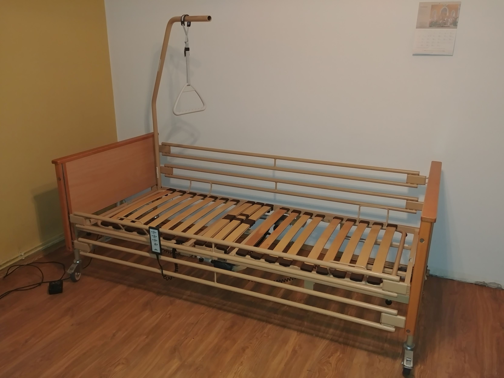
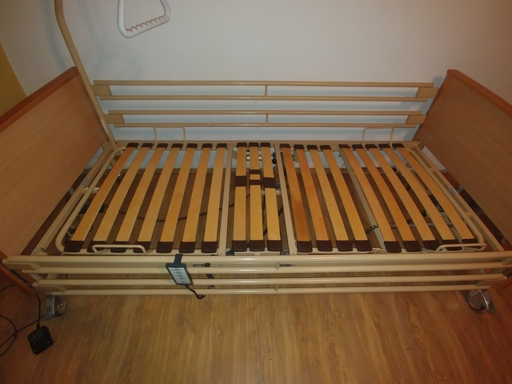
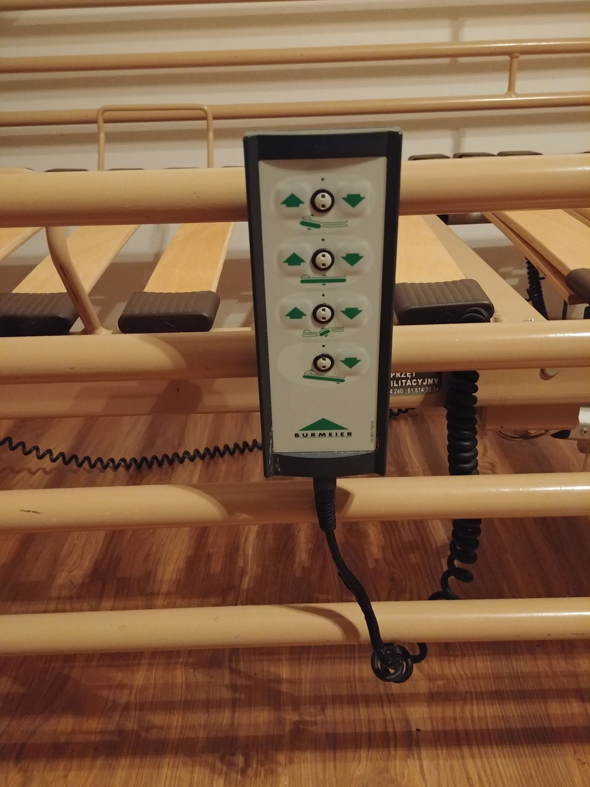

# Sprzedam używane łóżko medyczne (rehabilitacyjne) firmy Burmeier model Fortuna z wysięgnikiem.

## Opis
Łóżko jest w dobrym stanie, mechanizmy działają bez zarzutu.
* elektryczna regulacja wysokości w zakresie od 40 do 80 cm
* elektrycznie podnoszony zagłówek
* elektrycznie podnoszone leże pod nogami pacjenta z manualną funkcją wyprostu (na grzechotce)
* elektryczna funkcja przechyłu do pozycji Anty-Trendelenburga
* wszystkie funkcje łóżka sterowane elektrycznie przy pomocy pilota
* wykończenia boczków oraz barierki wykonane z drewna, kolor buk
* metalowe barierki z obu stron łóżka
* leże z drewnianymi lamelkami odporne na działanie środków dezynfekujących
* duże koła z możliwością blokady
* otwór na wysięgnik znajduje się z obu stron łóżka
* wysięgnik z trójkątem do podciągania się w komplecie!
* wymiary leża: 90 cm x 200 cm
* Obciążenie robocze: 175 kg (waga pacjenta 135 kg)

Preferowany odbiór osobisty na terenie Poznania, łóżko można złożyć, instrukcja użytkowania i składania:
http://sanitaetshaus-gimple.de/files/5014/0526/0444/GIMPLE_Burmeier_Pflegebett-FORTUNA-24V_Gebrauchsanweisung.pdf

